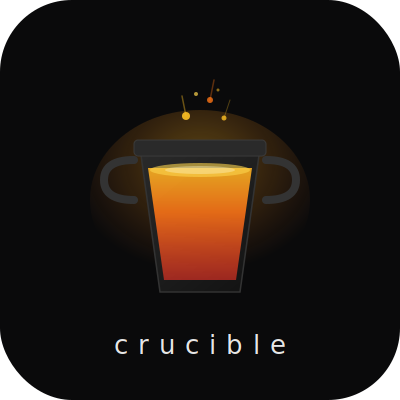

<div align="center">



# crucible

**Scaffold a landing page with a full AI agent system built in.**

[](https://www.npmjs.com/package/create-crucible)
[](LICENSE)
[](https://github.com/ryanda9910/crucible/actions)

```bash
npm create crucible@latest my-project
```

</div>

---

Answer 9 questions. Get a landing page scaffold where AI works inside a design system — not against it.

```
┌  crucible
│
◇  Project directory name
│  volta-studio
│
◇  Framework
│  Next.js 14 — App Router, SSR, API routes
│
◇  Brand name
│  Volta Studio
│
◇  Tagline (hero headline)
│  Every frame needs a sound.
│
◇  Primary color (hex)
│  #0A0A0B
│
  ... 4 more prompts
│
◇  Project generated.
│
└  ✓ Volta Studio — nextjs scaffold ready. Build something real.
```

## What's inside

Every scaffold ships two layers:

**AI system files** — framework-agnostic, always included:

| File | Purpose |
|---|---|
| `CLAUDE.md` | Session briefing — brand, stack, workflow rules |
| `DESIGN.md` | Design system ground truth (colors, type, spacing, motion) |
| `GUARDRAILS.md` | Failure memory — pre-loaded with common AI mistakes |
| `.claude/skills/copywriter` | Role constraints for copy tasks |
| `.claude/skills/qa-mobile` | Role constraints for mobile QA |
| `.claude/skills/ui-designer` | Role constraints for UI work |
| `scripts/check-design-tokens` | Blocks hardcoded hex values at commit |

**Framework source** — pre-wired to your brand:

| File | Purpose |
|---|---|
| `src/lib/site.ts` | Single source of truth for brand name, domain, email |
| `src/components/` | Hero, Services, Process, Contact, Header, Footer |
| API route | Zod-validated contact form + honeypot spam protection |
| `DESIGN.md` | Tailwind config tokens + anti-pattern list |

## Supported frameworks

| | Framework | Best for |
|---|---|---|
| ⬛ | **Next.js 14** (App Router) | SSR, API routes, SEO-heavy pages |
| 🟠 | **Astro 4** | Static sites, best Lighthouse scores |
| 🔵 | **Vite + React** | SPA, client-side only |
| ⬜ | **Vanilla JS** | No framework, minimal, fast |

## Why this exists

AI output quality is a function of the constraints you give it.

```
Slop     = AI + no context
Not slop = AI + design system + guardrails + concrete specs
```

A crucible is the vessel where raw material transforms into refined output. Same idea: your brand inputs go in, a constrained AI-ready scaffold comes out. The walls are set. The AI works inside them.

Built from lessons building [Sonara Studio](https://github.com/ryanda9910) landing page with Claude Code.

## Requirements

- Node.js ≥ 18
- pnpm (recommended) or npm

## After scaffolding

```bash
cd my-project
pnpm install

# Complete your design system:
#   DESIGN.md     → fill in type scale, spacing, component patterns
#   src/lib/      → add real content (services, work samples, testimonials)
#   GUARDRAILS.md → will grow as you build

pnpm dev
```

## Contributing

See [CONTRIBUTING.md](CONTRIBUTING.md). New framework templates, GUARDRAILS entries, and accessibility fixes are especially welcome.

```bash
git clone https://github.com/ryanda9910/crucible.git
cd crucible
pnpm install
pnpm dev   # run CLI interactively
```

Commits must follow [Conventional Commits](https://www.conventionalcommits.org/). Commitlint enforces this on every commit.

## License

MIT © [ryanda9910](https://github.com/ryanda9910)
